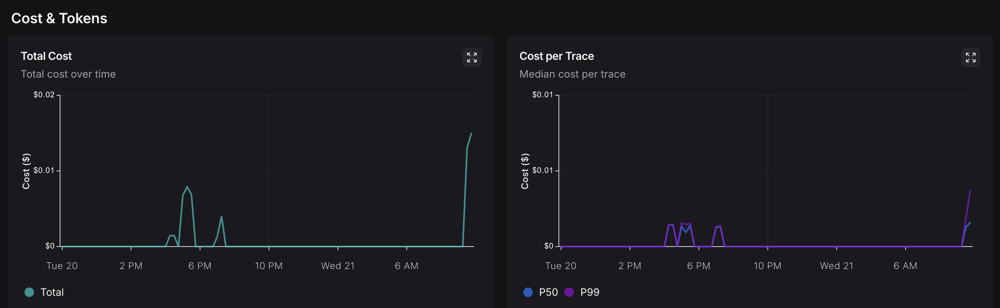
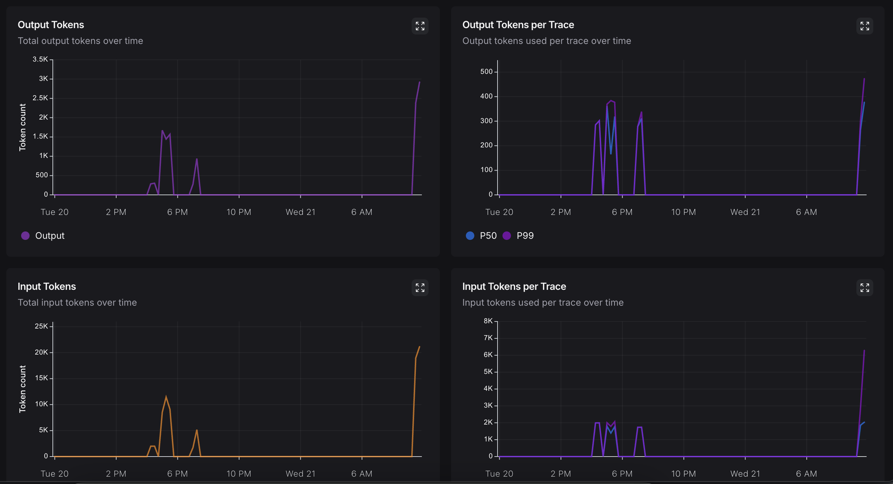

# Company Research Tool

A CLI tool that uses LangChain, OpenAI, and Tavily to research companies and fetch their logos and recent news articles.

# Assumptions, Know Issues and Improvements.
1. No unit tests are provided
2. Only one agent was proposed for this approach to keep it simple. A more sofisticated approach could be developed using Langgraph with Multiple agents with releflection.
3. This project was developed using a "vibe coding" approach with Cursor
4. Time frame was reduced to 4 to 5 hours as indicated in the email
5. I assumed that an OpenAI key is provided, so to run this project you MUST config your OPENAI_API_KEY and TAVILY_API_KEY.

## Architecture

### AI Components
- **LangChain**: Used as the orchestration framework to manage AI workflows and chain different operations together
- **OpenAI GPT**: Powers the natural language understanding and generation capabilities
- **Tavily**: Provides real-time news and information retrieval
- **Logo.dev**: Handles company logo retrieval and processing

### Prompt Engineering
The system uses a structured ReAct (Reasoning and Acting) prompt pattern that enables the AI to:
1. Analyze company information through a step-by-step reasoning process
2. Extract key insights from news articles
3. Generate a comprehensive company summary
4. Identify potential risks and opportunities

The ReAct pattern follows this structure:
- **Thought**: The AI reasons about what to do next
- **Action**: Selects an appropriate tool to use
- **Action Input**: Provides input to the selected tool
- **Observation**: Processes the tool's output
- This cycle repeats until the AI reaches a final answer

This approach ensures:
- Transparent decision-making process
- Iterative problem-solving
- Clear audit trail of the AI's reasoning
- Structured interaction with external tools

## Setup

1. Install Pipenv (if not already installed):
```bash
pip install pipenv
```

2. Activate the virtual environment:
```bash
pipenv shell
```

3. Install dependencies:
```bash
pipenv install
```

4. Set up environment variables:
Create a `.env` file in the root directory with the following variables:
```
OPENAI_API_KEY=your_openai_api_key_here
TAVILY_API_KEY=your_tavily_api_key_here
LOGO_API_KEY=your_logo_api_key_here (There's one already provided on .env.example)
```

You'll need to:
- Get an OpenAI API key from https://platform.openai.com/
- Get a Tavily API key from https://tavily.com/
- Get a Logo.dev API key from https://logo.dev

5. To Understand Tracing Call (Optional)
- Set up a new Project in https://smith.langchain.com/
- Get a LangSmith API Key 

## Usage

You can run the script in two ways:

1. With command line argument:
```bash
pipenv run python src/main.py --company stripe.com
```

The script will:
1. Fetch the company's logo using Logo.dev
2. Get 3 to 5 recent news articles about the company using Tavily
3. Display the results in a formatted output

# Costs and Tokens Analysis

| Metric | Value/Observation |
| :-- | :-- |
| **Time Window** | 1 day |
| **Most Recent Run** | 5/21/2025, 10:12:19 AM |
| **Run Count (1D)** | 41 |
| **Total Cost (1D)** | \$0.06 |
| **Total Cost (peak)** | Below \$0.02 at any single time |
| **Cost per Trace (P50/P99)** | Well below \$0.01 per trace |
| **Output Tokens (max batch)** | Peaks just above 3,000 tokens |
| **Output Tokens per Trace** | Most traces < 500 tokens (P99), median much lower |
| **Input Tokens (max batch)** | Peaks near 25,000 tokens |
| **Input Tokens per Trace** | Most traces < 7,000 tokens (P99), median much lower |
| **Efficiency** | Very low cost per run, moderate and controlled tokens |





# Examples

## 1. Ubersuggest

### bash
```bash
python src/main.py --company ubersugggest
```

### Langsmith Tace
https://smith.langchain.com/public/edd9d4f8-0414-48b7-a9b4-fce6d18cabb4/r/

### Output
# Company Logo 


# Company Info 
- Company Name: Ubersuggest
- Website: [ubersuggest.com](https://ubersuggest.com)
- Industry: SEO and content
- Chief Technology Officer: Mynul Hoda

# Company Summary
Ubersuggest is a global SEO and content tool that helps users with keyword research, competition analysis, backlink data, and traffic trends. It offers user-friendly features for small businesses and provides great long-term value with one-time payment plans.

# Recent News Articles
1. [Ubersuggest Announces Mynul Hoda as New Chief Technology Officer](https://www.globenewswire.com/search/organization/Ubersuggest)
2. [Gisele El Khoury published an article on Ubersuggest in Language Learning](https://www.stlawu.edu/news/gisele-el-khoury-published-article-ubersuggest-language-learning)
3. [Ubersuggest: A Comprehensive Guide for Maximum Results](https://neilpatel.com/blog/ubersuggest-guide/)
4. [The Future of Ubersuggest](https://neilpatel.com/blog/ubersuggest-update/)
5. [Ubersuggest Review 2025: Best Budget SEO Tool For ...](https://techfee.com/ubersuggest-review-2025/)

## 2. Notion.so

### bash
```bash
python src/main.py --company notion
```

### Langsmith Trace
https://smith.langchain.com/public/9de92940-c8f4-4f86-bb8a-c04842f6f416/r

### Output

Company: notion
# Company Logo 


# Company Info
- Domain: notion.so

# Company Summary
Notion is a popular productivity and collaboration tool that offers a variety of features to help individuals and teams organize their work efficiently.

# Recent News Articles
1. [What's New – Notion](https://www.notion.com/releases)
2. [EVERYTHING Notion Launched in 2024 (MASSIVE UPDATES!)](https://www.youtube.com/watch?v=Fxi6OAApodY)
3. [8 NEW Notion Updates You Don't Want to Miss! (February 2025)](https://www.youtube.com/watch?v=KYRMObh2-R4&pp=0gcJCdgAo7VqN5tD)